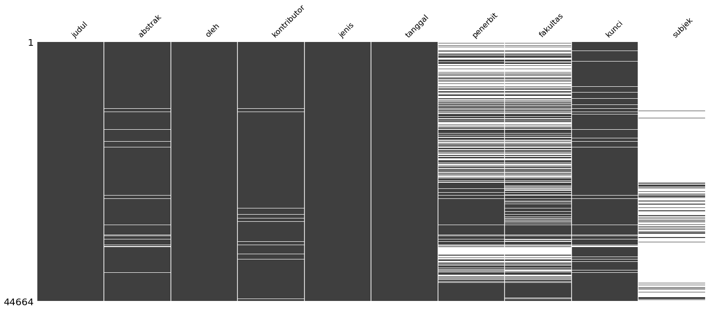

## abstrak
Salah satu program kerja di divisi Penelitian HIMATIKA ITB adalah \"Lex Luthor's Database\". Secara sederhana, proker ini bertugas untuk mencatat segala hal (baik kondisi internal maupun eksternal himpuunan) ke sebuah database. Dengan adanya database ini, diharapkan anggota himpunan (termasuk badan pengurus himpunan) dapat menerapkan kebijakan yang berbasis data. Ditugaskan untuk melakukan pendataan ini, saya memutuskan untuk melakukan scrapping website [Digital Library ITB](www.digilib.itb.ac.id).

## hasil
Dari hasil crawling, saya mendapatkan tabel seperti berikut:

Proses saya melakukan scrapping data TA mahasiswa matematika, secara mendetail dapat dibaca di [sini](https://nbviewer.jupyter.org/github/kekavigi/eksperimen/tree/master/download%20digilib/main.ipynb)

## to-do
1. analisis.
