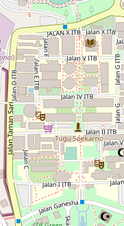
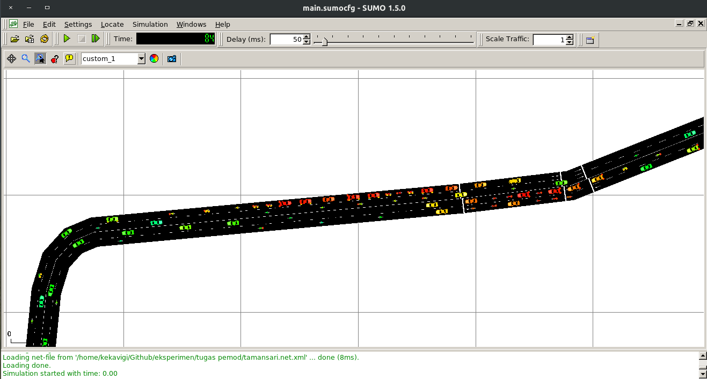

# Simulasi Arus Lalu Lintas




## Menjalankan Simulasi
Dari program SUMO, buka (Ctrl+O) kode simulasi `main.sumocfg`. Ganti pengaturan viewing (F9) dengan menggunakan `viewing.xml`. Selanjutnya tinggal jalankan simulasi :)


Terdapat dua versi route dalam repo ini. `tamansari.rou.xml` berisi data kendaraan dasar, sedangkan `tamansari_sublane.rou.xml` adalah versi pengembangan yang memperhatikan kendaraan yang stop, peluang untuk pindah lajur, dan sebagainya. Referensi dapat dilihat di masing-masing file. Hasil dari masing-masing simulasi dapat dilihat di file `out` dan `out_sublane`.

## Instalasi SUMO
> "Simulation of Urban MObility" (Eclipse SUMO) is an open source, highly portable, microscopic and continuous road traffic simulation package designed to handle large road networks.

Dengan menggunakan [SUMO](https://sumo.dlr.de/docs/), kita dapat mengambil data jalan raya dari OpenStreetMap secara cepat, membuat visualisasi dan data simulasi dengan mudah, dan (dengan menginstall hal lain, seperti [Flow](https://github.com/flow-project/flow)), memungkinkan meningkatkan kompleksitas simulasi. Untuk Ubuntu, SUMO dapat diinstall dengan
```
sudo -i
add-apt-repository ppa:sumo/stable
apt update && apt install sumo sumo-tools sumo-doc
```
Versi SUMO (dapat dicari dengan menjalankan `sumo --version`) yang dipakai pada proyek ini adalah 1.5.0


# TODO:
- [x] Konfigurasi agar kendaraan melajua dengan kecepatan standar ketika di-*spawn*
- [x] tambahkan Car Following Model
- [x] Atur jenis kendaraan; inflow speed, persentasi jumlah, dkk...
- [x] Rapikan visualisasi
- [ ] [Video recording hasil simulasi](https://sourceforge.net/p/sumo/mailman/message/27903061/)
- [ ] Tambahkan obstacle ke jalan, kalau bisa yang 'dinamis' (misal terjadi sekitar 10 menit sekali)
